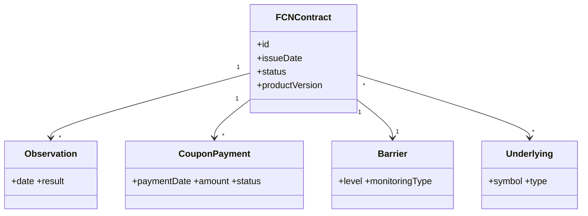

# Conceptual Domain Model

## 1. Narrative
Describe the high-level entities involved in an FCN lifecycle.

## 2. Entities (Conceptual)
| Entity | Description | Key Attributes (Conceptual) | Relationships |
|--------|-------------|-----------------------------|---------------|
| FCNContract | Represents a single issued FCN | id, issueDate, productVersion, status | 1..* Observations, 1..* CouponPayments |
| Underlying | Asset referenced by the FCN | symbol, type | N..M with FCNContract |
| Observation | Scheduled evaluation of barrier/coupon condition | date, result | Belongs to FCNContract |
| CouponPayment | Payment obligation (conditional) | paymentDate, amount, status | Linked to Observation |
| Barrier | Defines KI threshold | level, monitoringType | 1..1 FCNContract |
| ParameterSet | Collection of contract parameters | name, version | 1..1 FCNContract |

## 3. Diagram (Mermaid Placeholder)

## 4. State Transitions (High-Level)
| From | Event | To | Notes |
|------|-------|----|-------|
| Draft | ValidationSuccess | Active | After parameter acceptance |
| Active | MaturityReached | Matured | |
| Active | EarlyRedemptionEvent | Redeemed | Optional future |
| Active | DefaultEvent | Terminated | |

## 5. Open Modeling Questions
| ID | Question | Owner | Needed By | Status |
|----|----------|-------|-----------|--------|
| DM-01 | Represent barrier events separately? | Architecture | 2025-10-16 | Open |