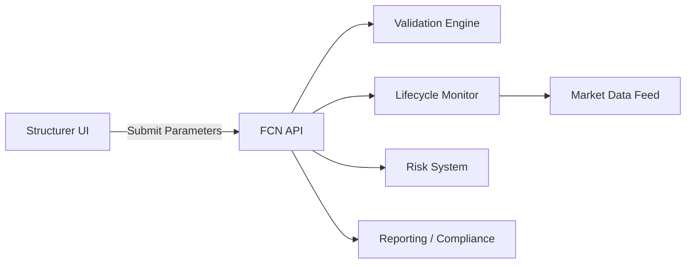

# Integration Context

## 1. Context Diagram (Placeholder)

## 2. External Systems
| System | Interaction Type | Direction | Frequency/Latency | Data Exchanged | Notes |
|--------|------------------|----------|-------------------|----------------|-------|
| Market Data Feed | Query/Subscribe | Inbound | Intraday | Underlying prices | For barrier |
| Risk System | API/Event | Outbound | Near real-time | Contract parameters | For exposure calc |
| Reporting | Batch/Event | Outbound | Daily / On event | Contract + lifecycle | Regulatory |

## 3. Integration Constraints
| Constraint | Description | Impact |
|------------|-------------|--------|
| Latency Budget | Validation response < 1s | API design |
| Throughput | Peak parameter submissions per hour TBD | Capacity planning |

## 4. Open Integration Questions
| ID | Question | Owner | Due | Status |
|----|----------|-------|-----|--------|
| INT-01 | Event vs. REST for market data changes? | Architecture | 2025-10-20 | Open |