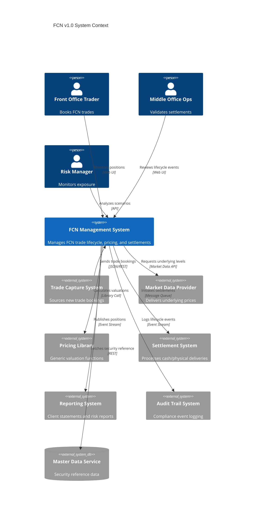
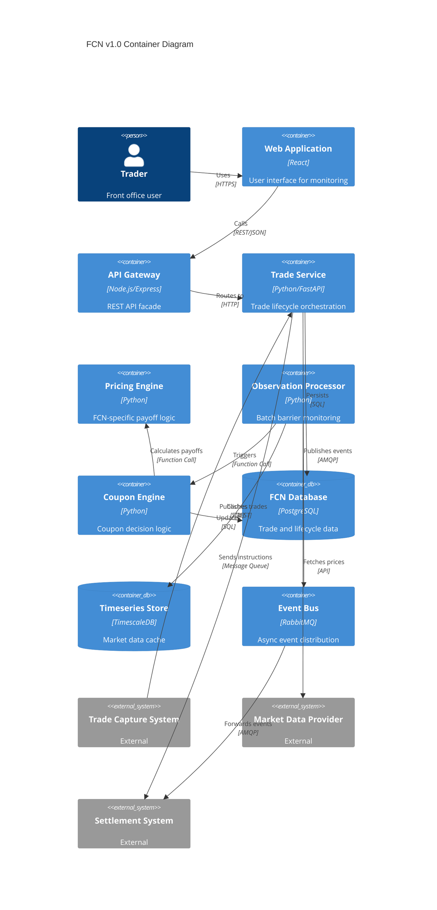

# FCN v1.0 Context Architecture View

## 1. Context

### 1.1 Purpose
This document presents the context architecture view for the Fixed Coupon Note (FCN) v1.0 product implementation. It defines the system boundary, external actors, integration points, and high-level responsibilities within the broader enterprise ecosystem.

### 1.2 Scope
The FCN v1.0 system encompasses:
- Trade lifecycle management (booking, observation, settlement)
- Pricing and valuation engine
- Coupon decision logic
- Barrier monitoring
- Data persistence and audit trails
- Integration interfaces with upstream/downstream systems

**Out of Scope:**
- Implementation of external market data providers
- Client-facing portfolio management UI (separate system)
- Settlement system implementation (integration only)

### 1.3 Architectural Drivers
- **Accuracy**: Payoff calculations must match specification test vectors exactly
- **Auditability**: All lifecycle events must be traceable for compliance
- **Extensibility**: Support future FCN variants (v1.1+) without breaking changes
- **Integration**: Clean interfaces with existing trade capture and market data systems
- **Performance**: Process daily observations for portfolio of 1000+ FCN trades within SLA

## 2. Quality Attributes

| Attribute | Priority | Rationale | Target Metric |
|-----------|----------|-----------|---------------|
| Correctness | P0 | Financial accuracy is non-negotiable | 100% test vector match |
| Auditability | P0 | Regulatory requirement | All events logged |
| Availability | P1 | Business continuity for daily processing | 99.5% during business hours |
| Performance | P1 | Daily batch processing window | < 30 min for 1000 trades |
| Maintainability | P1 | Enable rapid variant development | < 2 weeks for minor enhancements |
| Scalability | P2 | Growth accommodation | Support 5000 trades within 2 years |

## 3. Views

### 3.1 Context View

### 3.2 Container View

## 4. Data Considerations

### 4.1 Data Ownership
- **FCN System Owns**: Trade records, observation results, coupon decisions, calculated cash flows
- **External Systems Own**: Market prices, settlement confirmations, client account data

### 4.2 Data Volumes (Initial Estimates)
- Trades: ~100-200 new trades/month, ~1000 active trades
- Observations: ~20 observation dates/trade × 1000 trades = 20,000 events/year
- Market data: ~5 underlyings/trade × daily snapshots = ~250,000 price points/year

### 4.3 Data Retention
- Trade records: Retain for 7 years post-maturity (regulatory)
- Observation history: Retain for trade lifetime + 7 years
- Market data cache: Retain for 3 months (operational)
- Audit logs: Retain for 10 years

## 5. Risks & Technical Debt

| Risk | Impact | Likelihood | Mitigation |
|------|--------|------------|------------|
| Market data provider downtime | High | Medium | Cache last-known prices; manual override capability |
| Schema evolution breaking clients | Medium | Medium | API versioning; backward compatibility contracts |
| Test vector drift from spec | High | Low | CI/CD validation gate; normative test suite |
| Performance degradation at scale | Medium | Medium | Batch optimization; database indexing strategy |
| Security vulnerability in API | High | Low | OWASP compliance; regular penetration testing |

### Technical Debt
- Initial implementation uses synchronous REST for observation processing (batch async preferred)
- No circuit breaker pattern for external service calls (add in phase 2)
- Logging framework not yet centralized (ELK stack integration planned)

## 6. Decisions

Reference ADRs:
- [ADR-001: Documentation Governance](../../design-decisions/adr-001-documentation-governance.md)
- [ADR-002: Product Documentation Structure](../../design-decisions/adr-002-product-doc-structure.md)
- [ADR-003: FCN Version Activation Workflow](../../design-decisions/adr-003-fcn-version-activation.md)
- [ADR-004: Parameter Alias Policy](../../design-decisions/adr-004-parameter-alias-policy.md)

Key architectural decisions:
- **Event-driven architecture** for lifecycle state changes (enables audit trail and downstream integration)
- **Python** for pricing/calculation components (data science ecosystem, numerical precision)
- **PostgreSQL** for transactional data (ACID guarantees, JSON support for flexible parameters)
- **TimescaleDB extension** for time-series market data (optimized for time-based queries)

## 7. Open Issues

| ID | Description | Owner | Target Date |
|----|-------------|-------|-------------|
| OI-001 | Define API versioning strategy | SA | 2025-10-20 |
| OI-002 | Finalize market data caching policy | SA | 2025-10-25 |
| OI-003 | Determine observation processing schedule | BA/Ops | 2025-10-30 |
| OI-004 | Select monitoring/alerting platform | Ops | 2025-11-15 |
| OI-005 | Define disaster recovery procedures | SA/Ops | 2025-11-30 |

## 8. Change Log

| Version | Date | Author | Change |
|---------|------|--------|--------|
| 0.1.0 | 2025-10-10 | siripong.s@yuanta.co.th | Initial context view for FCN v1.0 |
