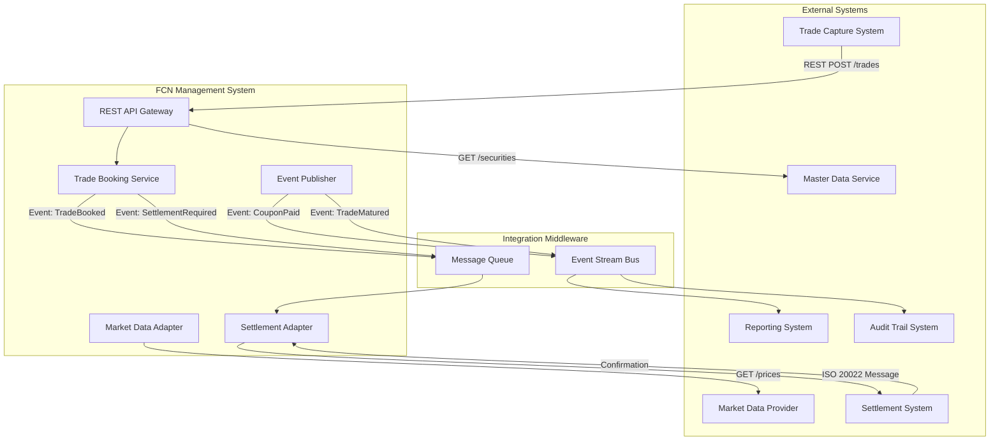

# FCN v1.0 Integration Architecture View

> **⚠️ SUPERSEDED**: This architecture view is based on FCN v1.0 specification, which was superseded on 2025-10-17 by [fcn-v1.1.0](../../../ba/products/structured-notes/fcn/specs/fcn-v1.1.0.md).
> 
> **Status**: This document is retained for historical reference and existing v1.0 trade implementations only. New implementations should refer to FCN v1.1.0 documentation.
> 
> **Key Changes in v1.1.0**: Capital-at-risk settlement, autocall/knock-out capability, issuer governance, and barrier monitoring type.
> 
> See [SUPERSEDED_INDEX.md](../../../ba/products/structured-notes/fcn/specs/SUPERSEDED_INDEX.md) and [ADR-005](../../design-decisions/adr-005-fcn-supersession-governance.md) for supersession governance details.

## 1. Context

### 1.1 Purpose
This document details the integration architecture for FCN v1.0, defining API contracts, protocols, message formats, and integration patterns with external systems.

### 1.2 Scope
This view covers:
- REST API specifications
- Message queue contracts
- Event schemas
- Integration patterns
- Error handling strategies
- Data transformation rules

### 1.3 Integration Principles
- **Contract-First Design**: API contracts defined before implementation
- **Backward Compatibility**: Avoid breaking changes; version APIs
- **Idempotency**: All state-changing operations support retry safety
- **Graceful Degradation**: Handle external system failures without data loss
- **Event-Driven Communication**: Async notifications for lifecycle events

## 2. Quality Attributes

| Attribute | Target | Design Strategy |
|-----------|--------|-----------------|
| Interoperability | Standard protocols | REST/JSON, AMQP, ISO 20022 messages |
| Reliability | 99.9% message delivery | Message persistence, retry logic, DLQ |
| Latency | < 500ms for sync APIs | Async processing for heavy operations |
| API Versioning | Backward compatible | URI versioning (/v1/, /v2/) |

## 3. Views

### 3.1 Integration Overview



### 3.2 API Specifications

#### Trade Booking API

**Endpoint:** `POST /api/v1/trades`

**Request Schema:**
```json
{
  "trade_id": "string (external reference)",
  "product_code": "FCN",
  "product_version": "1.0",
  "branch_code": "base-mem",
  "trade_date": "2025-01-15",
  "issue_date": "2025-01-20",
  "maturity_date": "2026-01-20",
  "notional_amount": "1000000.00",
  "currency": "USD",
  "underlying_symbols": ["AAPL", "MSFT", "GOOGL"],
  "initial_levels": [150.00, 370.00, 140.00],
  "knock_in_barrier_pct": 0.65,
  "coupon_rate_pct": 0.10,
  "coupon_condition_threshold_pct": 0.65,
  "observation_dates": ["2025-04-20", "2025-07-20", "2025-10-20", "2026-01-20"],
  "coupon_payment_dates": ["2025-04-25", "2025-07-25", "2025-10-25", "2026-01-25"],
  "is_memory_coupon": true,
  "memory_carry_cap_count": null,
  "recovery_mode": "par-recovery",
  "settlement_type": "physical-settlement",
  "documentation_version": "fcn-v1.0"
}
```

**Response Schema (Success):**
```json
{
  "status": "success",
  "trade_id": "FCN-2025-001234",
  "external_reference": "string (from request)",
  "booked_at": "2025-01-15T10:30:00Z",
  "validation_warnings": []
}
```

**Response Schema (Validation Error):**
```json
{
  "status": "error",
  "error_code": "VALIDATION_FAILED",
  "message": "Trade validation failed",
  "errors": [
    {
      "field": "knock_in_barrier_pct",
      "error": "Must be less than redemption_barrier_pct"
    }
  ]
}
```

**HTTP Status Codes:**
- `201 Created`: Trade booked successfully
- `400 Bad Request`: Validation failure
- `409 Conflict`: Duplicate trade_id
- `500 Internal Server Error`: System error

**Idempotency:**
- Use `Idempotency-Key` header
- Duplicate requests with same key return original response

---

#### Query Trade API

**Endpoint:** `GET /api/v1/trades/{trade_id}`

**Response Schema:**
```json
{
  "trade_id": "FCN-2025-001234",
  "product_code": "FCN",
  "status": "active",
  "trade_date": "2025-01-15",
  "maturity_date": "2026-01-20",
  "notional_amount": "1000000.00",
  "currency": "USD",
  "ki_triggered": false,
  "ki_date": null,
  "accrued_unpaid_coupons": 0,
  "last_observation_date": null,
  "underlyings": [
    {
      "symbol": "AAPL",
      "initial_level": 150.00,
      "current_level": 155.00,
      "performance": 0.0333
    }
  ],
  "cash_flows": [
    {
      "flow_id": "CF-001",
      "flow_type": "coupon",
      "scheduled_date": "2025-04-25",
      "amount": "100000.00",
      "status": "pending"
    }
  ],
  "_links": {
    "self": "/api/v1/trades/FCN-2025-001234",
    "observations": "/api/v1/trades/FCN-2025-001234/observations",
    "cash_flows": "/api/v1/trades/FCN-2025-001234/cash-flows"
  }
}
```

---

#### Observation Processing API

**Endpoint:** `POST /api/v1/observations`

**Request Schema:**
```json
{
  "observation_date": "2025-04-20",
  "trade_ids": ["FCN-2025-001234", "FCN-2025-001235"],
  "mode": "auto"
}
```

**Response Schema:**
```json
{
  "status": "success",
  "observation_date": "2025-04-20",
  "trades_processed": 2,
  "trades_failed": 0,
  "results": [
    {
      "trade_id": "FCN-2025-001234",
      "status": "success",
      "ki_triggered": false,
      "coupon_paid": true,
      "coupon_amount": "100000.00"
    }
  ],
  "processing_time_ms": 1234
}
```

### 3.3 Event Schemas

#### TradeBooked Event

**Topic:** `fcn.trades.booked`

**Schema:**
```json
{
  "event_id": "evt-12345",
  "event_type": "TradeBooked",
  "timestamp": "2025-01-15T10:30:00Z",
  "version": "1.0",
  "payload": {
    "trade_id": "FCN-2025-001234",
    "product_code": "FCN",
    "product_version": "1.0",
    "trade_date": "2025-01-15",
    "notional_amount": "1000000.00",
    "currency": "USD",
    "underlying_symbols": ["AAPL", "MSFT", "GOOGL"]
  }
}
```

---

#### BarrierBreached Event

**Topic:** `fcn.barriers.breached`

**Schema:**
```json
{
  "event_id": "evt-67890",
  "event_type": "BarrierBreached",
  "timestamp": "2025-04-20T16:00:00Z",
  "version": "1.0",
  "payload": {
    "trade_id": "FCN-2025-001234",
    "observation_date": "2025-04-20",
    "barrier_type": "knock-in",
    "breached_underlyings": [
      {
        "symbol": "AAPL",
        "level": 97.50,
        "initial_level": 150.00,
        "barrier_level": 97.50,
        "breach_pct": 0.65
      }
    ]
  }
}
```

---

#### CouponPaid Event

**Topic:** `fcn.coupons.paid`

**Schema:**
```json
{
  "event_id": "evt-11111",
  "event_type": "CouponPaid",
  "timestamp": "2025-04-20T16:05:00Z",
  "version": "1.0",
  "payload": {
    "trade_id": "FCN-2025-001234",
    "observation_date": "2025-04-20",
    "payment_date": "2025-04-25",
    "coupon_amount": "100000.00",
    "currency": "USD",
    "accrued_unpaid_count": 0,
    "memory_reset": true
  }
}
```

---

#### SettlementRequired Event

**Topic:** `fcn.settlements.required`

**Schema:**
```json
{
  "event_id": "evt-22222",
  "event_type": "SettlementRequired",
  "timestamp": "2026-01-20T16:00:00Z",
  "version": "1.0",
  "payload": {
    "trade_id": "FCN-2025-001234",
    "maturity_date": "2026-01-20",
    "settlement_date": "2026-01-22",
    "settlement_type": "physical-settlement",
    "ki_triggered": true,
    "redemption_amount": "1000000.00",
    "delivery_underlyings": [
      {
        "symbol": "AAPL",
        "quantity": 2222.22,
        "final_level": 145.00
      }
    ]
  }
}
```

### 3.4 Market Data Integration

**Protocol:** REST API over HTTPS

**Endpoint:** `GET /api/v1/market-data/prices`

**Request Parameters:**
- `symbols`: Comma-separated list of symbols
- `date`: Observation date (YYYY-MM-DD)
- `time`: Optional time (HH:MM:SS), defaults to close

**Response Schema:**
```json
{
  "prices": [
    {
      "symbol": "AAPL",
      "date": "2025-04-20",
      "time": "16:00:00",
      "price": 155.00,
      "currency": "USD",
      "source": "NASDAQ"
    }
  ],
  "as_of": "2025-04-20T16:00:00Z"
}
```

**Error Handling:**
- Cache last known prices for up to 24 hours
- Retry with exponential backoff (3 attempts)
- Alert operations if provider unavailable > 1 hour
- Support manual price override via Admin API

### 3.5 Settlement Integration

**Protocol:** ISO 20022 `pain.001` message over AMQP

**Message Type:** Credit Transfer (Cash Settlement)

**Sample Message:**
```xml
<?xml version="1.0" encoding="UTF-8"?>
<Document xmlns="urn:iso:std:iso:20022:tech:xsd:pain.001.001.03">
  <CstmrCdtTrfInitn>
    <GrpHdr>
      <MsgId>FCN-SETT-2026-001234</MsgId>
      <CreDtTm>2026-01-20T16:00:00Z</CreDtTm>
    </GrpHdr>
    <PmtInf>
      <PmtInfId>PMT-001234</PmtInfId>
      <PmtMtd>TRF</PmtMtd>
      <ReqdExctnDt>2026-01-22</ReqdExctnDt>
      <Dbtr>
        <Nm>Yuanta Securities</Nm>
      </Dbtr>
      <CdtTrfTxInf>
        <Amt Ccy="USD">1000000.00</Amt>
        <Cdtr>
          <Nm>Client Account 12345</Nm>
        </Cdtr>
        <RmtInf>
          <Ustrd>FCN Redemption - Trade FCN-2025-001234</Ustrd>
        </RmtInf>
      </CdtTrfTxInf>
    </PmtInf>
  </CstmrCdtTrfInitn>
</Document>
```

**Message Type:** Physical Delivery Instruction

**Custom JSON Format:**
```json
{
  "instruction_id": "FCN-DELV-2026-001234",
  "instruction_type": "physical_delivery",
  "trade_id": "FCN-2025-001234",
  "settlement_date": "2026-01-22",
  "client_account": "12345",
  "deliveries": [
    {
      "symbol": "AAPL",
      "isin": "US0378331005",
      "quantity": 2222.22,
      "delivery_method": "DTC"
    }
  ]
}
```

**Confirmation Processing:**
- Receive settlement confirmation via `fcn.settlements.confirmed` topic
- Update trade status to `settled`
- Publish `TradeSettled` event
- Archive trade to long-term storage

## 4. Data Considerations

### 4.1 Data Transformation Rules

**External Trade Booking → Internal Trade:**
- Map `external_trade_id` → `trade_id` (with prefix)
- Validate all dates are business days
- Convert percentage inputs to decimal (10% → 0.10)
- Default `memory_carry_cap_count` to null (unlimited)

**Market Data → Observation:**
- Extract close price for each symbol
- Validate price > 0
- Cache for 24 hours
- Log data source and timestamp

### 4.2 Error Handling Patterns

**Retry Strategy:**
- Exponential backoff: 1s, 2s, 4s, 8s, 16s
- Max 5 retries
- Circuit breaker: open after 10 consecutive failures
- Half-open test after 60 seconds

**Dead Letter Queue:**
- Failed messages moved to DLQ after max retries
- Alert operations for DLQ depth > 10
- Manual review and replay capability

### 4.3 API Rate Limits

| Endpoint | Rate Limit | Burst |
|----------|------------|-------|
| POST /trades | 100/min | 200 |
| GET /trades/* | 1000/min | 2000 |
| POST /observations | 10/min | 20 |
| GET /market-data/prices | 500/min | 1000 |

## 5. Risks & Technical Debt

| Risk | Impact | Mitigation |
|------|--------|------------|
| Market data provider outage | High | Local cache, manual override |
| Message queue overflow | Medium | Auto-scaling, monitoring alerts |
| API version proliferation | Medium | Deprecation policy, migration guides |
| Settlement message failures | High | Message persistence, DLQ, alerting |

### Technical Debt
- No API gateway authentication yet (add OAuth 2.0)
- Synchronous settlement processing (convert to async)
- Hard-coded retry parameters (externalize to config)

## 6. Decisions

Key integration decisions:
- **REST for Synchronous, AMQP for Async**: Balance latency and reliability
- **JSON for REST, ISO 20022 for Settlement**: Standard compliance
- **Event-Driven Architecture**: Enable loose coupling with downstream systems
- **Idempotency Keys**: Prevent duplicate processing on retry

## 7. Open Issues

| ID | Description | Owner | Target Date |
|----|-------------|-------|-------------|
| OI-010 | Finalize market data provider contract | SA | 2025-10-25 |
| OI-011 | Define API authentication mechanism | SA/Security | 2025-10-30 |
| OI-012 | Specify message retention policy | SA/Ops | 2025-11-05 |
| OI-013 | Design API versioning migration strategy | SA | 2025-11-10 |

## 8. Change Log

| Version | Date | Author | Change |
|---------|------|--------|--------|
| 0.1.0 | 2025-10-10 | siripong.s@yuanta.co.th | Initial integration view for FCN v1.0 |
| 0.2.0 | 2025-10-17 | siripong.s@yuanta.co.th | Marked as Superseded; added supersession notice referencing FCN v1.1.0, SUPERSEDED_INDEX.md, and ADR-005 |
