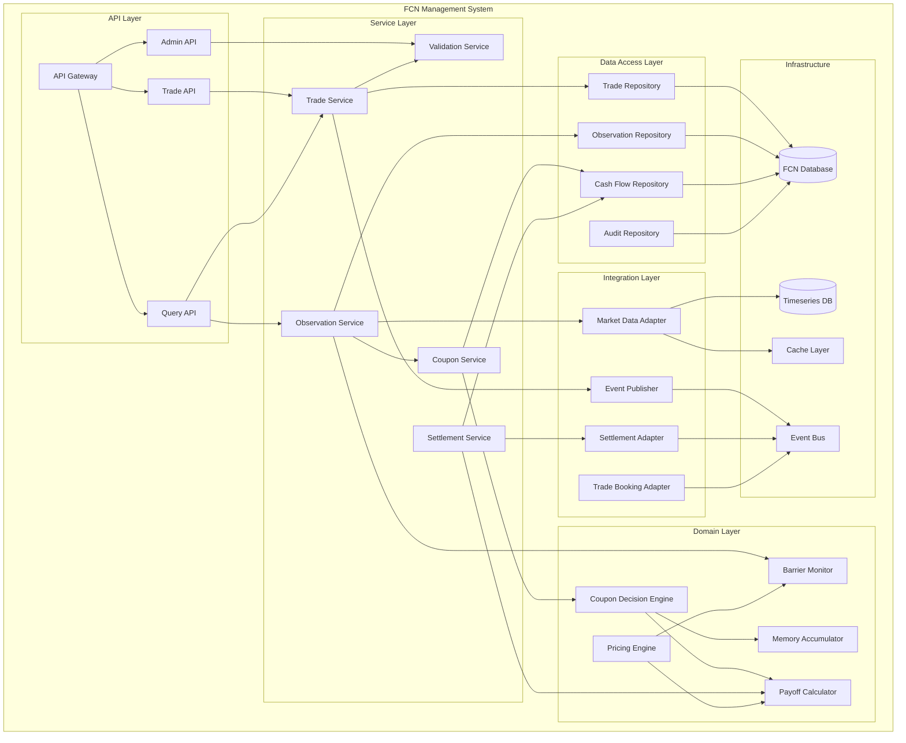

# FCN v1.0 Logical Architecture View

## 1. Context

### 1.1 Purpose
This document presents the logical architecture view for FCN v1.0, defining the internal component structure, responsibilities, and interactions within the FCN Management System.

### 1.2 Scope
This view covers:
- Logical component decomposition
- Component responsibilities and interfaces
- Internal data flows
- Key algorithms and business logic patterns

### 1.3 Relationship to Other Views
- **Context View**: External systems referenced here are detailed in context view
- **Integration View**: API contracts expanded in integration view
- **Security View**: Authentication/authorization mechanisms detailed in security view

## 2. Quality Attributes

| Attribute | Target | Design Strategy |
|-----------|--------|-----------------|
| Modularity | High cohesion, low coupling | Domain-driven component boundaries |
| Testability | 80%+ code coverage | Dependency injection, interface-based design |
| Correctness | 100% test vector match | Separate calculation engine with normative test suite |
| Maintainability | Support variant evolution | Plugin architecture for payoff logic |

## 3. Views

### 3.1 Component Diagram



### 3.2 Component Responsibilities

#### API Layer

**API Gateway**
- Request routing and load balancing
- Authentication and authorization
- Rate limiting and throttling
- Request/response logging

**Trade API**
- Trade booking endpoints
- Trade amendment/cancellation
- Trade query operations
- Bulk trade operations

**Query API**
- Position queries
- Cash flow projections
- Historical observation data
- Performance analytics

**Admin API**
- System configuration
- Manual override capabilities
- Batch job triggers
- Health checks and diagnostics

#### Service Layer

**Trade Service**
- Orchestrates trade lifecycle operations
- Validates trade parameters against schema
- Persists trade records
- Publishes trade lifecycle events
- **Key Methods:**
  - `book_trade(trade_params) -> TradeId`
  - `amend_trade(trade_id, amendments) -> void`
  - `cancel_trade(trade_id, reason) -> void`
  - `get_trade(trade_id) -> Trade`

**Observation Service**
- Orchestrates daily observation processing
- Coordinates market data retrieval
- Triggers barrier monitoring
- Invokes coupon decision logic
- **Key Methods:**
  - `process_observations(observation_date) -> ObservationResult`
  - `record_underlying_levels(trade_id, date, levels) -> void`
  - `check_barriers(trade_id, date) -> BarrierStatus`

**Coupon Service**
- Evaluates coupon conditions
- Manages memory accumulation
- Generates coupon cash flows
- Schedules payment instructions
- **Key Methods:**
  - `evaluate_coupon(trade_id, obs_date) -> CouponDecision`
  - `generate_cash_flow(trade_id, decision) -> CashFlow`
  - `schedule_payment(cash_flow) -> void`

**Settlement Service**
- Orchestrates maturity settlements
- Determines redemption amounts
- Handles physical vs cash settlement
- Sends settlement instructions
- **Key Methods:**
  - `settle_maturity(trade_id) -> SettlementInstruction`
  - `calculate_redemption(trade_id) -> RedemptionAmount`
  - `generate_physical_delivery(trade_id) -> DeliveryInstruction`

**Validation Service**
- Validates trade parameters against schema
- Enforces business rules
- Checks data integrity constraints
- Validates against test vectors
- **Key Methods:**
  - `validate_trade_params(params) -> ValidationResult`
  - `validate_against_test_vector(trade_id, vector_id) -> bool`
  - `check_business_rules(trade) -> RuleViolations[]`

#### Domain Layer

**Pricing Engine**
- Orchestrates valuation calculations
- Coordinates scenario analysis
- Manages pricing models
- **Key Methods:**
  - `price_trade(trade, market_data) -> Price`
  - `calculate_greeks(trade, market_data) -> Greeks`
  - `scenario_analysis(trade, scenarios) -> Results[]`

**Coupon Decision Engine**
- Implements coupon condition logic (BR-006)
- Evaluates memory accumulation rules (BR-008)
- Calculates coupon amounts (BR-009)
- **Algorithm:**
  ```
  For each observation date:
    1. Check if ALL underlyings >= initial × coupon_condition_threshold_pct
    2. If yes: pay (accrued_unpaid + 1) × notional × coupon_rate_pct
    3. If no and memory: increment accrued_unpaid (capped by memory_carry_cap_count)
    4. If no and no-memory: accrued_unpaid remains 0
  ```
- **Key Methods:**
  - `evaluate_condition(underlyings, threshold) -> bool`
  - `calculate_amount(notional, rate, accrued) -> Decimal`
  - `update_memory_state(state, condition_met) -> State`

**Barrier Monitor**
- Implements knock-in logic (BR-005)
- Monitors barrier breaches
- Updates KI status
- **Algorithm:**
  ```
  For each observation date:
    If ANY underlying <= initial × knock_in_barrier_pct:
      Set ki_triggered = true
      Record ki_date
  ```
- **Key Methods:**
  - `check_barrier(underlyings, barrier) -> bool`
  - `record_ki_event(trade_id, date) -> void`
  - `get_ki_status(trade_id) -> bool`

**Payoff Calculator**
- Calculates final redemption amounts
- Implements par recovery logic (BR-011)
- Implements proportional loss logic (BR-012)
- **Algorithm (Par Recovery):**
  ```
  If maturity date:
    If ALL underlyings >= initial × redemption_barrier_pct:
      redemption = notional_amount
    Else if recovery_mode == 'par-recovery':
      redemption = notional_amount  (regardless of KI)
    Else if recovery_mode == 'proportional-loss' AND ki_triggered:
      redemption = min(underlying_levels / initial_levels) × notional_amount
  ```
- **Key Methods:**
  - `calculate_redemption(trade, final_levels) -> Decimal`
  - `determine_settlement_type(trade, ki_status) -> SettlementType`

**Memory Accumulator**
- Tracks unpaid coupon count
- Enforces memory cap (BR-008)
- Provides memory state queries
- **Key Methods:**
  - `increment(state, cap) -> State`
  - `reset(state) -> State`
  - `get_accrued_count(trade_id) -> int`

#### Data Access Layer

**Trade Repository**
- CRUD operations for trades
- Trade queries and filters
- Version management
- **Key Methods:**
  - `save(trade) -> void`
  - `find_by_id(trade_id) -> Trade`
  - `find_by_criteria(criteria) -> Trade[]`
  - `find_maturing_on(date) -> Trade[]`

**Observation Repository**
- Stores observation events
- Underlying level history
- Observation queries
- **Key Methods:**
  - `record_observation(trade_id, date, levels) -> void`
  - `get_observation_history(trade_id) -> Observation[]`
  - `get_levels_on_date(trade_id, date) -> Levels`

**Cash Flow Repository**
- Stores coupon and redemption flows
- Payment status tracking
- Cash flow projections
- **Key Methods:**
  - `save_cash_flow(flow) -> void`
  - `get_pending_payments(date) -> CashFlow[]`
  - `get_trade_cash_flows(trade_id) -> CashFlow[]`

**Audit Repository**
- Logs all lifecycle events
- Immutable audit trail
- Query audit history
- **Key Methods:**
  - `log_event(event) -> void`
  - `get_audit_trail(trade_id) -> Event[]`
  - `search_events(criteria) -> Event[]`

#### Integration Layer

**Market Data Adapter**
- Fetches underlying prices from provider
- Caches recent prices
- Handles provider failover
- **Key Methods:**
  - `get_price(symbol, date) -> Price`
  - `get_prices_batch(symbols, date) -> Prices[]`
  - `subscribe_realtime(symbol, callback) -> Subscription`

**Trade Booking Adapter**
- Receives trade bookings from capture system
- Transforms external format to internal
- Acknowledges receipt
- **Key Methods:**
  - `receive_trade(external_trade) -> void`
  - `transform(external_trade) -> InternalTrade`
  - `acknowledge(trade_id, status) -> void`

**Settlement Adapter**
- Sends settlement instructions
- Receives confirmations
- Handles settlement failures
- **Key Methods:**
  - `send_instruction(instruction) -> void`
  - `receive_confirmation(confirmation) -> void`
  - `retry_failed(instruction_id) -> void`

**Event Publisher**
- Publishes lifecycle events to bus
- Manages event schemas
- Ensures delivery guarantees
- **Key Methods:**
  - `publish(event) -> void`
  - `publish_batch(events[]) -> void`

## 4. Data Considerations

### 4.1 Data Model Alignment
The component design aligns with the domain model in the [Domain Handoff Package](../../handoff/domain-handoff-fcn-v1.0.md):
- **Trade Service** manages `Trade` and `Underlying_Asset` entities
- **Observation Service** manages `Observation` and `Underlying_Level` entities
- **Coupon Service** manages `Coupon_Decision` and `Cash_Flow` entities

### 4.2 Transaction Boundaries
- **Trade Booking**: Single database transaction (Trade + Underlyings + Audit)
- **Observation Processing**: Transaction per trade (Observation + Levels + Barrier Check)
- **Coupon Evaluation**: Transaction per trade (Decision + Cash Flow + Memory Update)
- **Settlement**: Transaction per trade (Cash Flow + Settlement Instruction + Audit)

### 4.3 Concurrency Control
- Optimistic locking for trade amendments (version column)
- Pessimistic locking for observation processing (row-level locks)
- Idempotency keys for external API calls (prevent duplicate processing)

## 5. Risks & Technical Debt

| Risk | Impact | Mitigation |
|------|--------|------------|
| Complex memory accumulation logic | Medium | Extensive unit tests with all edge cases |
| Barrier monitoring race conditions | High | Database locks during observation processing |
| Cash flow calculation precision errors | High | Use decimal types throughout; validate against test vectors |
| Event publishing failures | Medium | Implement outbox pattern for guaranteed delivery |

### Technical Debt
- Monolithic service layer (consider microservices split in future)
- Synchronous observation processing (add async batch processing)
- Hard-coded business rules (externalize to rule engine in v2.0)

## 6. Decisions

Key design decisions:
- **Repository Pattern**: Clean separation of domain logic from persistence
- **Domain-Driven Design**: Align components with business domain concepts
- **Event Sourcing (Partial)**: Use event bus for cross-cutting concerns (not full event sourcing)
- **Decimal Precision**: Use Python `decimal.Decimal` for all monetary and percentage calculations

## 7. Open Issues

| ID | Description | Owner | Target Date |
|----|-------------|-------|-------------|
| OI-006 | Define retry strategy for external integrations | SA | 2025-10-25 |
| OI-007 | Specify database indexing strategy | SA/DBA | 2025-10-30 |
| OI-008 | Determine batch vs real-time observation mode | BA | 2025-11-05 |
| OI-009 | Define component deployment boundaries | SA/Ops | 2025-11-10 |

## 8. Change Log

| Version | Date | Author | Change |
|---------|------|--------|--------|
| 0.1.0 | 2025-10-10 | siripong.s@yuanta.co.th | Initial logical view for FCN v1.0 |
