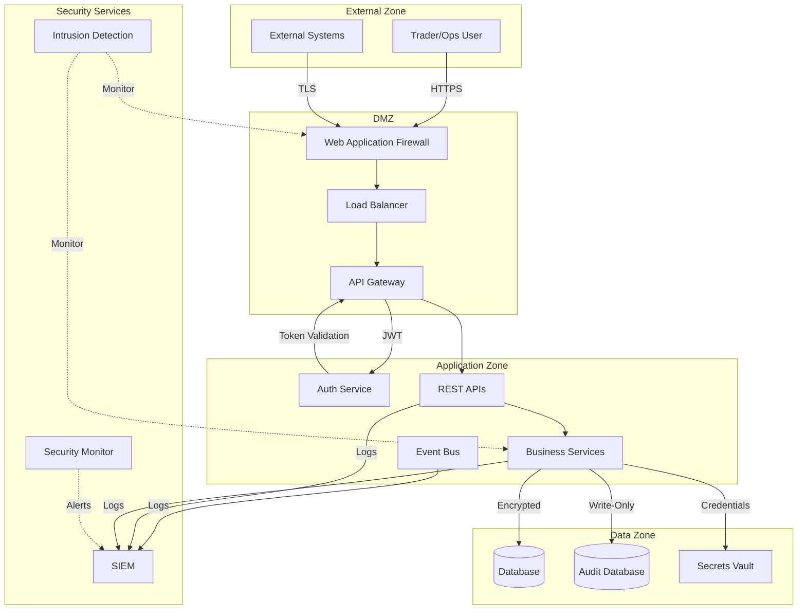
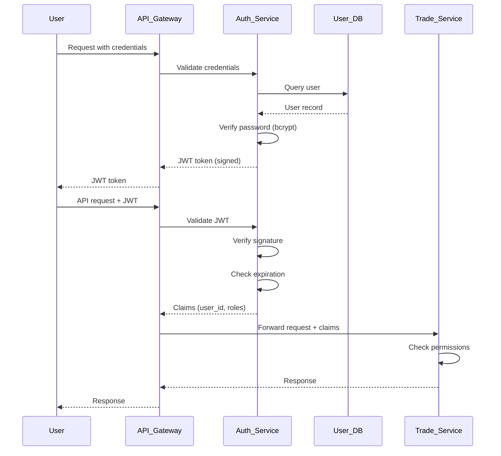

# FCN v1.0 Security Architecture View

> **⚠️ SUPERSEDED**: This architecture view is based on FCN v1.0 specification, which was superseded on 2025-10-17 by [fcn-v1.1.0](../../../ba/products/structured-notes/fcn/specs/fcn-v1.1.0.md).
> 
> **Status**: This document is retained for historical reference and existing v1.0 trade implementations only. New implementations should refer to FCN v1.1.0 documentation.
> 
> **Key Changes in v1.1.0**: Capital-at-risk settlement, autocall/knock-out capability, issuer governance, and barrier monitoring type.
> 
> See [SUPERSEDED_INDEX.md](../../../ba/products/structured-notes/fcn/specs/SUPERSEDED_INDEX.md) and [ADR-005](../../design-decisions/adr-005-fcn-supersession-governance.md) for supersession governance details.

## 1. Context

### 1.1 Purpose
This document defines the security architecture for FCN v1.0, covering authentication, authorization, data protection, audit logging, and compliance requirements.

### 1.2 Scope
This view covers:
- Authentication and authorization mechanisms
- Data classification and protection
- Network security
- Audit and compliance logging
- Threat model and mitigations
- Security monitoring and incident response

### 1.3 Security Principles
- **Defense in Depth**: Multiple layers of security controls
- **Least Privilege**: Users and services granted minimal necessary access
- **Zero Trust**: Verify explicitly, never assume trust
- **Audit Everything**: Complete audit trail for compliance
- **Data Protection**: Encrypt sensitive data at rest and in transit

## 2. Quality Attributes

| Attribute | Target | Design Strategy |
|-----------|--------|-----------------|
| Confidentiality | No unauthorized data access | RBAC, encryption, network segmentation |
| Integrity | No unauthorized data modification | Digital signatures, checksums, audit logs |
| Availability | 99.9% uptime | DDoS protection, redundancy, backup |
| Auditability | 100% event logging | Immutable audit trail, log retention |
| Compliance | Pass all regulatory audits | GDPR, SOX, MiFID II alignment |

## 3. Views

### 3.1 Security Architecture Overview



### 3.2 Authentication Flow



### 3.3 Authorization Model (RBAC)

**Roles:**

| Role | Description | Permissions |
|------|-------------|-------------|
| `trader` | Front office trader | Read trades, book trades, view positions |
| `ops` | Middle office operations | Read all, modify settlements, trigger observations |
| `admin` | System administrator | Full access, configuration, manual overrides |
| `readonly` | Reporting/analytics | Read-only access to all data |
| `system` | Service account | Inter-service communication |

**Permissions Matrix:**

| Resource | trader | ops | admin | readonly | system |
|----------|--------|-----|-------|----------|--------|
| POST /trades | ✓ | ✓ | ✓ | ✗ | ✓ |
| GET /trades/* | ✓ | ✓ | ✓ | ✓ | ✓ |
| PUT /trades/* | ✗ | ✓ | ✓ | ✗ | ✗ |
| DELETE /trades/* | ✗ | ✗ | ✓ | ✗ | ✗ |
| POST /observations | ✗ | ✓ | ✓ | ✗ | ✓ |
| GET /audit-logs | ✗ | ✓ | ✓ | ✗ | ✗ |
| POST /admin/overrides | ✗ | ✗ | ✓ | ✗ | ✗ |

**Implementation:**
```python
# Decorator-based authorization
@require_role(['trader', 'ops', 'admin'])
def book_trade(request):
    # Trade booking logic
    pass

@require_permission('read:trades')
def get_trade(request, trade_id):
    # Query trade logic
    pass
```

### 3.4 Data Classification and Protection

**Data Classification:**

| Classification | Description | Examples | Protection |
|----------------|-------------|----------|------------|
| **Public** | No confidentiality requirement | Product specs (published) | None |
| **Internal** | Company confidential | Test vectors, business rules | Access control |
| **Confidential** | Client sensitive | Trade details, PII | Encryption + RBAC |
| **Restricted** | Highly sensitive | Pricing models, passwords | Encryption + MFA + Audit |

**FCN Data Classification:**

| Data Type | Classification | At Rest | In Transit | Retention |
|-----------|----------------|---------|------------|-----------|
| Trade Records | Confidential | AES-256 | TLS 1.3 | 7 years post-maturity |
| Client PII | Restricted | AES-256 + Key Rotation | TLS 1.3 | Per GDPR/local law |
| Market Data | Internal | None (cached) | TLS 1.3 | 3 months |
| Audit Logs | Confidential | AES-256 | TLS 1.3 | 10 years |
| API Keys | Restricted | Vault (AES-256) | N/A (never transit) | Until revoked |
| Database Passwords | Restricted | Vault (AES-256) | N/A | 90 days rotation |

**Encryption Keys:**
- Master keys stored in Hardware Security Module (HSM)
- Application keys derived from master keys
- Key rotation every 90 days for Restricted data
- Separate keys per environment (dev, staging, prod)

### 3.5 Network Security

**Network Zones:**

```
[Internet] → [WAF] → [DMZ (API Gateway)] → [App Zone (Services)] → [Data Zone (DB)]
                                         ↓
                                    [Security Zone (SIEM, IDS)]
```

**Firewall Rules:**

| Source | Destination | Port | Protocol | Purpose |
|--------|-------------|------|----------|---------|
| Internet | WAF | 443 | HTTPS | User/system API access |
| WAF | API Gateway | 8080 | HTTP | Internal routing |
| API Gateway | App Services | 8000-8099 | HTTP | Service calls |
| App Services | PostgreSQL | 5432 | TCP | Database access |
| App Services | RabbitMQ | 5672 | AMQP | Message queue |
| All Zones | SIEM | 514 | Syslog | Log aggregation |

**DMZ Restrictions:**
- API Gateway has no direct database access
- No outbound internet access from App Zone (except via proxy)
- All inter-zone traffic logged

### 3.6 Audit Logging

**Audit Events (Must Log):**

1. **Authentication Events:**
   - User login (success/failure)
   - JWT token issuance
   - Session expiration/logout
   - Password change/reset

2. **Authorization Events:**
   - Permission denied
   - Role assignment change
   - Privilege escalation attempts

3. **Data Access Events:**
   - Trade creation/modification/deletion
   - Trade query (who accessed which trade)
   - Bulk data export
   - PII access

4. **Lifecycle Events:**
   - Observation processing
   - Barrier breach
   - Coupon payment
   - Settlement execution

5. **Configuration Events:**
   - System configuration change
   - Feature flag toggle
   - Manual override

6. **Security Events:**
   - Failed authentication attempts (> 3)
   - Suspicious activity patterns
   - Rate limit exceeded
   - API key revocation

**Audit Log Schema:**
```json
{
  "event_id": "audit-12345",
  "timestamp": "2025-01-15T10:30:00.123Z",
  "event_type": "TradeAccessed",
  "severity": "INFO",
  "user_id": "trader-001",
  "user_ip": "10.0.1.50",
  "session_id": "sess-abc123",
  "resource_type": "Trade",
  "resource_id": "FCN-2025-001234",
  "action": "READ",
  "result": "success",
  "details": {
    "endpoint": "/api/v1/trades/FCN-2025-001234",
    "method": "GET",
    "user_agent": "Mozilla/5.0..."
  },
  "signature": "SHA256:abcdef..."
}
```

**Log Integrity:**
- All logs signed with HMAC-SHA256
- Logs immutable (append-only database)
- Tamper detection via checksum chain
- Off-site backup to cold storage

**SIEM Integration:**
- Real-time log streaming to SIEM
- Correlation rules for suspicious patterns
- Automated alerts for critical events
- Dashboards for security monitoring

## 4. Threat Model and Mitigations

### 4.1 Threat Analysis

| Threat | Likelihood | Impact | Mitigation |
|--------|------------|--------|------------|
| **SQL Injection** | Medium | High | Parameterized queries, ORM, input validation |
| **XSS (Cross-Site Scripting)** | Low | Medium | Content Security Policy, output encoding |
| **CSRF (Cross-Site Request Forgery)** | Low | Medium | CSRF tokens, SameSite cookies |
| **Unauthorized Data Access** | Medium | High | RBAC, audit logs, encryption |
| **Man-in-the-Middle** | Low | High | TLS 1.3, certificate pinning |
| **Credential Theft** | Medium | High | Password hashing (bcrypt), MFA |
| **DDoS Attack** | High | Medium | Rate limiting, WAF, CDN |
| **Insider Threat** | Low | High | Least privilege, separation of duties, audit logs |
| **Data Exfiltration** | Low | High | DLP, network monitoring, encryption |
| **Supply Chain Attack** | Low | High | Dependency scanning, SBOMs, signed packages |

### 4.2 OWASP Top 10 Mitigations

| OWASP Risk | Mitigation |
|------------|------------|
| A01:2021 – Broken Access Control | RBAC enforcement, permission checks on every endpoint |
| A02:2021 – Cryptographic Failures | TLS 1.3, AES-256, key rotation, HSM for master keys |
| A03:2021 – Injection | Parameterized queries, input validation, ORM |
| A04:2021 – Insecure Design | Threat modeling, secure design reviews |
| A05:2021 – Security Misconfiguration | Hardened configs, automated scanning, CIS benchmarks |
| A06:2021 – Vulnerable Components | Dependency scanning (Snyk), SBOM, patch management |
| A07:2021 – Auth/AuthN Failures | bcrypt, JWT expiration, MFA for admin |
| A08:2021 – Data Integrity Failures | Digital signatures, checksums, audit logs |
| A09:2021 – Logging Failures | Comprehensive audit logging, SIEM integration |
| A10:2021 – SSRF | Input validation, allowlist for external URLs, no user-supplied URLs |

## 5. Compliance Requirements

### 5.1 Regulatory Alignment

**SOX (Sarbanes-Oxley):**
- Accurate financial reporting
- Internal control documentation
- Audit trail retention (7 years)
- Separation of duties

**MiFID II:**
- Trade transparency
- Best execution reporting
- Transaction reporting
- Record keeping (5-7 years)

**GDPR (General Data Protection Regulation):**
- Lawful basis for PII processing
- Right to erasure (after retention period)
- Data breach notification (72 hours)
- Data protection by design

### 5.2 Compliance Controls

| Control | Requirement | Implementation |
|---------|-------------|----------------|
| **Audit Trail** | All transactions logged | Immutable audit database, SIEM |
| **Data Retention** | 7+ years for trades | Automated archival, cold storage |
| **Access Control** | Least privilege | RBAC, permission matrix |
| **Separation of Duties** | No single user can book and settle | Role restrictions |
| **Data Breach Response** | < 72 hours notification | Incident response plan, automated alerts |
| **Encryption** | Sensitive data encrypted | AES-256 at rest, TLS 1.3 in transit |
| **PII Protection** | Minimize collection, secure storage | Data classification, encryption, access logs |

### 5.3 Audit Readiness

**Audit Artifacts:**
- Access control matrix (this document)
- User provisioning/deprovisioning logs
- Change management records
- Security incident reports
- Penetration test results
- Vulnerability scan reports

**Regular Reviews:**
- Quarterly access control review
- Annual security architecture review
- Bi-annual penetration testing
- Continuous vulnerability scanning

## 6. Security Monitoring and Incident Response

### 6.1 Security Monitoring

**Alerts (Immediate):**
- Failed authentication (> 5 attempts in 5 min)
- Privilege escalation attempt
- Unusual data export volume
- Database connection from unauthorized IP
- SSL certificate expiration (< 30 days)

**Metrics (Dashboard):**
- Authentication success/failure rate
- API error rate by endpoint
- Unauthorized access attempts
- Average response time (detect slowdown attacks)
- Database query patterns (detect SQL injection)

### 6.2 Incident Response Plan

**Phases:**
1. **Detection**: SIEM alerts, user reports
2. **Containment**: Isolate affected systems, revoke compromised credentials
3. **Eradication**: Remove threat, patch vulnerabilities
4. **Recovery**: Restore services, verify integrity
5. **Lessons Learned**: Post-mortem, update controls

**Escalation:**
- P0 (Critical): Data breach, system compromise → Page on-call, notify CISO
- P1 (High): Repeated attack attempts, DDoS → Alert security team
- P2 (Medium): Failed authentication spike → Monitor, investigate
- P3 (Low): Single failed login → Log only

## 7. Risks & Technical Debt

| Risk | Impact | Mitigation |
|------|--------|------------|
| JWT token theft | High | Short expiration (15 min), refresh tokens, token revocation list |
| Database encryption key compromise | Critical | Key rotation, HSM, multi-party key custody |
| SIEM log tampering | Medium | Off-site backup, log signing, immutable storage |
| Unpatched vulnerabilities | High | Automated patching, dependency scanning, SLA for critical patches |

### Technical Debt
- No MFA for regular users yet (add in phase 2)
- API rate limiting per-endpoint only (add per-user quotas)
- Manual security reviews (automate with SAST/DAST tools)

## 8. Decisions

Key security decisions:
- **JWT for API Authentication**: Stateless, scalable, standard
- **RBAC over ABAC**: Simpler for initial implementation, sufficient for v1.0
- **PostgreSQL RLS (Row-Level Security)**: Database-level access control
- **Immutable Audit Logs**: Append-only database with WORM storage

## 9. Open Issues

| ID | Description | Owner | Target Date |
|----|-------------|-------|-------------|
| OI-014 | Finalize MFA provider selection | Security | 2025-10-30 |
| OI-015 | Define data retention policy for PII | Legal/Compliance | 2025-11-05 |
| OI-016 | Select HSM vendor for key management | SA/Security | 2025-11-15 |
| OI-017 | Design API key rotation mechanism | SA | 2025-11-20 |

## 10. Change Log

| Version | Date | Author | Change |
|---------|------|--------|--------|
| 0.1.0 | 2025-10-10 | siripong.s@yuanta.co.th | Initial security view for FCN v1.0 |
| 0.2.0 | 2025-10-17 | siripong.s@yuanta.co.th | Marked as Superseded; added supersession notice referencing FCN v1.1.0, SUPERSEDED_INDEX.md, and ADR-005 |
