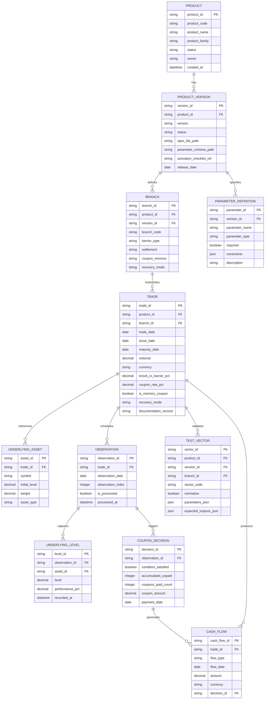

# FCN v1.0 Domain Handoff Package

## 1. Overview and Scope

### 1.1 Purpose
This document serves as the domain handoff package from Business Analysis to Solution Architecture for the Fixed Coupon Note (FCN) v1.0 product. It consolidates business domain knowledge to enable API design, database schema implementation, and system integration analysis.

### 1.2 Scope
**In Scope:**
- FCN v1.0 baseline specification (single/basket underlying, memory/no-memory coupons)
- Down-in (knock-in) barrier monitoring on discrete observation dates
- Physical settlement with par-recovery mode (normative)
- Parameter definitions and constraints
- Core business processes (trade capture, observation, coupon decision, settlement)
- Initial business rules and validation requirements
- Logical data model for persistence
- Integration touchpoints (market data, trade booking, settlement)

**Out of Scope:**
- Step-down/step-up barrier schedules (deferred to v1.1+)
- Advanced autocall or averaging features
- Continuous barrier monitoring
- Parameter alias lifecycle (introduced in v1.1+)
- Implementation-specific pricing algorithms
- UI/UX specifications

### 1.3 Target Audience
- Solution Architects (API & database design)
- Backend Engineers (implementation)
- Data Engineers (ETL & persistence)
- QA Engineers (test strategy)
- Product Owners (feature validation)

---

## 2. Stakeholders and Actors

| Role | Responsibilities | Contact | Interest Level |
|------|------------------|---------|----------------|
| Product Owner | Defines economic behavior, approves specification | siripong.s@yuanta.co.th | High |
| Business Analyst | Documents requirements, validates test vectors | siripong.s@yuanta.co.th | High |
| Solution Architect | Designs API & data model, defines integration | siripong.s@yuanta.co.th | High |
| Backend Engineer | Implements pricing engine & lifecycle processing | TBD | High |
| Data Engineer | Implements persistence & reporting pipelines | TBD | Medium |
| Risk Manager | Reviews calibration scenarios & stress tests | TBD | Medium |
| Compliance Officer | Validates regulatory alignment & audit trails | TBD | Medium |
| QA Engineer | Validates test coverage & regression suite | TBD | High |
| Front Office Trader | Books trades, monitors positions | TBD | Medium |
| Middle Office Operations | Validates settlements & lifecycle events | TBD | Medium |

### System Actors
- **Trade Capture System**: Sources trade bookings
- **Market Data Provider**: Delivers underlying levels for observations
- **Pricing Engine**: Computes valuations and payoff scenarios
- **Settlement System**: Processes cash flows and physical deliveries
- **Reporting System**: Generates client statements and risk reports
- **Audit Trail System**: Records all lifecycle events for compliance

---

## 3. Glossary (FCN-Specific Terms)

| Term | Definition | Source | Notes |
|------|------------|--------|-------|
| FCN | Fixed Coupon Note - A structured note paying periodic fixed coupons contingent on barrier conditions | Product Spec | Core product acronym |
| Knock-In (KI) | Event triggered when underlying breaches barrier level, switching to recovery mode | Product Economics | Also called "barrier breach" |
| Memory Coupon | Feature allowing unpaid coupons to accrue and pay later when conditions are met | Product Spec | Accumulator mechanism |
| Par Recovery | Recovery mode returning 100% of notional at maturity despite KI event | Product Spec | Normative for v1.0 baseline |
| Proportional Loss | Recovery mode delivering underlying assets proportionally to breach level | Product Spec | Non-normative in v1.0 |
| Physical Settlement | Delivery of underlying assets rather than cash equivalent | Product Spec | Normative for v1.0 |
| Barrier Monitoring | Process of checking underlying levels against KI barrier on observation dates | Product Spec | Discrete only in v1.0 |
| Discrete Monitoring | Barrier evaluated only on scheduled observation dates (v1.0 in-scope) | Product Spec | Normative monitoring type |
| Continuous Monitoring | Barrier monitored continuously throughout life (deferred to v1.1+) | Product Spec | Future enhancement |
| Observation Date | Scheduled date for evaluating coupon conditions and barrier breaches | Product Spec | Excludes maturity unless explicit |
| Coupon Condition | Threshold requirement (e.g., all underlyings above X% of initial) for coupon payment | Product Spec | Independent per underlying |
| Redemption Barrier | Final barrier level determining par redemption eligibility at maturity | Product Spec | Distinct from KI barrier |
| Branch | Taxonomy-specific payoff variant (e.g., base-mem, base-nomem) | Governance | Used for variant classification |
| Normative Test Vector | Required test case for version promotion from Proposed to Active | ADR-003 | Quality gate artifact |
| Parameter Schema | JSON Schema defining trade parameters, types, and constraints | Technical | Validation contract |
| Documentation Version | Traceability anchor linking trade to specification version | Product Spec | Audit requirement |
| Draft Status | Product/version under initial development | Product Lifecycle | Pre-production status |
| Proposed Status | Product/version ready for activation review | Product Lifecycle | Pre-production status |
| Active Status | Product/version approved for trading | Product Lifecycle | Production status |
| Deprecated Status | Product/version no longer recommended but existing trades continue | Product Lifecycle | Phase-out status |
| Removed Status | Product/version fully retired, no new trades allowed | Product Lifecycle | Archived status |

---

## 4. Conceptual Domain Model

### 4.1 Domain Entities (Mermaid Diagram)



### 4.2 Key Domain Concepts

**Product Lifecycle:**
- Product → Product_Version → Branch → Trade
- Status progression: Proposed → Active → Deprecated → Removed
- Version promotion requires activation checklist completion

**Trade Lifecycle:**
- Trade Booking → Observation Processing → Coupon Decision → Cash Flow Generation → Settlement
- Barrier monitoring occurs on each observation date
- KI event triggers recovery mode switch

**Coupon Logic:**
- Memory: Unpaid coupons accumulate, paid when conditions satisfied
- No-Memory: Each period independent, missed coupons lost
- Condition: All underlyings must stay above coupon_condition_threshold_pct

**Settlement Modes:**
- Physical: Deliver underlying assets (normative for v1.0)
- Cash: Pay cash equivalent (non-normative)

### 4.3 Enumeration Definitions (v1.0 Scope)

This subsection documents all enumeration values used in FCN v1.0, marking which values are in-scope for v1.0 and which are deferred to future versions.

#### 4.3.1 Product / Product_Version Status

**Enum Values:**
- `Draft` - Specification under development (pre-production)
- `Proposed` - Ready for activation review (pre-production)
- `Active` - Production-ready and approved for trading
- `Deprecated` - No longer recommended; existing trades continue
- `Removed` - Fully retired; no new trades allowed

**Status Transition Workflow:** Draft → Proposed → Active → Deprecated → Removed

**v1.0 Scope:** All status values in-scope.

#### 4.3.2 Trade Status (Lifecycle)

**Enum Values:**
- `booked` - Trade booked but not yet issued (v1.0 in-scope)
- `active` - Trade issued and active (v1.0 in-scope)
- `matured` - Trade reached maturity date (v1.0 in-scope)
- `terminated` - Trade terminated early (deferred to v1.1+)
- `redeemed` - Final settlement completed (v1.0 in-scope)

**v1.0 Scope:** `booked`, `active`, `matured`, `redeemed` are in-scope. `terminated` deferred (early termination not supported).

#### 4.3.3 Barrier Monitoring Type (monitoringType)

**Enum Values:**
- `discrete` - Barrier evaluated only on scheduled observation dates (v1.0 in-scope, normative)
- `continuous` - Barrier monitored continuously throughout life (deferred to v1.1+)

**v1.0 Scope:** Only `discrete` monitoring supported. Continuous monitoring requires intraday market data infrastructure (deferred).

**Field Name:** `barrier_monitoring` in trade parameters

#### 4.3.4 Settlement Type

**Enum Values:**
- `physical-settlement` - Deliver underlying assets at maturity (v1.0 in-scope, normative)
- `cash-settlement` - Deliver cash equivalent at maturity (v1.0 in-scope, non-normative)

**v1.0 Scope:** `physical-settlement` normative; `cash-settlement` may appear in examples only (non-normative).

#### 4.3.5 Recovery Mode

**Enum Values:**
- `par-recovery` - Return 100% notional at maturity regardless of KI (v1.0 in-scope, normative)
- `proportional-loss` - Deliver underlying proportional to worst performance (v1.0 in-scope, non-normative)

**v1.0 Scope:** `par-recovery` normative; `proportional-loss` may appear in examples only (non-normative).

#### 4.3.6 Knock-In Condition

**Enum Values:**
- `any-underlying-breach` - KI triggered if any underlying breaches barrier (v1.0 in-scope)
- `all-underlying-breach` - KI triggered only if all underlyings breach (deferred to v1.1+)
- `worst-of` - KI based on worst performing underlying (deferred to v1.1+)

**v1.0 Scope:** Only `any-underlying-breach` supported.

#### 4.3.7 Day Count Convention

**Enum Values:**
- `ACT/365` - Actual days / 365 (v1.0 in-scope, default)
- `ACT/360` - Actual days / 360 (v1.0 in-scope)
- `30/360` - 30 days per month / 360 days per year (deferred to v1.1+)

**v1.0 Scope:** `ACT/365` and `ACT/360` supported; default is `ACT/365`.

#### 4.3.8 Cash Flow Type

**Enum Values:**
- `coupon` - Periodic coupon payment (v1.0 in-scope)
- `redemption` - Final principal redemption (v1.0 in-scope)
- `fee` - Administrative or structuring fee (deferred to v1.1+)
- `early-redemption` - Early termination payment (deferred to v1.1+)

**v1.0 Scope:** Only `coupon` and `redemption` flow types supported.

---

## 5. Core Processes

### 5.1 Trade Capture Process

**Trigger:** Front office books new FCN trade  
**Owner:** Trading System Integration  
**Steps:**
1. Validate trade parameters against parameter schema
2. Verify branch taxonomy conformance
3. Record underlying initial levels
4. Generate observation schedule
5. Store trade record with documentation version
6. Emit trade booked event

**Inputs:**
- Trade parameters (JSON)
- Market data (initial levels)
- Product version reference

**Outputs:**
- Persisted trade record
- Observation schedule
- Trade ID

**Business Rules:**
- BR-001: Trade date ≤ issue date < maturity date
- BR-002: All underlying initial levels must be > 0
- BR-003: KI barrier < redemption barrier ≤ 1.0
- BR-004: Documentation version must match active product version

### 5.2 Observation Processing

**Trigger:** Observation date reached (daily batch or real-time)  
**Owner:** Lifecycle Processing Engine  
**Steps:**
1. Retrieve scheduled observations for date
2. Fetch underlying levels from market data
3. Calculate performance vs. initial levels
4. Evaluate barrier breach (KI condition)
5. Evaluate coupon condition
6. Record observation results
7. Trigger coupon decision if observation complete

**Inputs:**
- Observation schedule
- Market data feed (underlying levels)

**Outputs:**
- Underlying level records
- KI event flag (if triggered)
- Coupon decision trigger

**Business Rules:**
- BR-005: KI occurs if any underlying closes ≤ initial × knock_in_barrier_pct
- BR-006: Coupon condition satisfied if all underlyings close ≥ initial × coupon_condition_threshold_pct
- BR-007: Observation recorded once per observation date (idempotent)

### 5.3 Coupon Decision Process

**Trigger:** Observation processing complete  
**Owner:** Coupon Logic Engine  
**Steps:**
1. Check coupon condition status
2. If memory enabled:
   - Check accumulated unpaid count
   - If condition satisfied: pay all accumulated + current
   - If not satisfied: increment accumulated count
3. If no memory:
   - If condition satisfied: pay current coupon
   - If not satisfied: no payment
4. Calculate coupon amount
5. Record coupon decision
6. Generate cash flow records

**Inputs:**
- Observation result
- Previous coupon state (if memory)
- Trade parameters (coupon_rate_pct, is_memory_coupon)

**Outputs:**
- Coupon decision record
- Cash flow records
- Updated accumulated unpaid count

**Business Rules:**
- BR-008: Memory coupon accumulates up to memory_carry_cap_count (if set)
- BR-009: Coupon amount = notional × coupon_rate_pct × coupons_paid_count
- BR-010: Payment date from coupon_payment_dates schedule

### 5.4 Maturity Settlement Process

**Trigger:** Maturity date reached  
**Owner:** Settlement Engine  
**Steps:**
1. Retrieve trade and lifecycle state
2. Check KI event status
3. Evaluate final redemption condition
4. If KI triggered → apply recovery mode:
   - Par recovery: return 100% notional
   - Proportional loss: deliver underlying assets
5. If no KI → check final barrier:
   - All above redemption barrier → return 100% notional
   - Any below → apply recovery mode
6. Generate final cash flow / delivery instruction
7. Mark trade settled

**Inputs:**
- Trade record
- KI event flag
- Final underlying levels
- Recovery mode

**Outputs:**
- Settlement instruction (cash or physical)
- Final cash flow record
- Trade status update

**Business Rules:**
- BR-011: Par recovery returns 100% notional regardless of final levels
- BR-012: Physical settlement delivers pro-rata underlying units
- BR-013: Final coupon paid if conditions satisfied (separate from redemption)

---

## 6. Initial Business Rules Table

| Rule ID | Category | Description | Source | Owner | Priority | Status |
|---------|----------|-------------|--------|-------|----------|--------|
| BR-001 | Validation | trade_date ≤ issue_date < maturity_date | Spec §3 | BA | P0 | Draft |
| BR-002 | Validation | All initial_levels > 0 | Spec §3 | BA | P0 | Draft |
| BR-003 | Validation | 0 < knock_in_barrier_pct < redemption_barrier_pct ≤ 1.0 | Spec §3 | BA | P0 | Draft |
| BR-004 | Validation | documentation_version must match active product version | Governance | BA | P1 | Draft |
| BR-005 | KI Logic | KI triggered if ANY underlying closes ≤ initial × knock_in_barrier_pct | Spec §5 | BA | P0 | Draft |
| BR-006 | Coupon Logic | Coupon condition satisfied if ALL underlyings close ≥ initial × coupon_condition_threshold_pct | Spec §5 | BA | P0 | Draft |
| BR-007 | Observation | Each observation date processed exactly once (idempotent) | Technical | SA | P0 | Draft |
| BR-008 | Coupon Logic | Memory accumulation capped at memory_carry_cap_count (if set) | Spec §5 | BA | P1 | Draft |
| BR-009 | Coupon Calc | coupon_amount = notional × coupon_rate_pct × coupons_paid_count | Spec §5 | BA | P0 | Draft |
| BR-010 | Coupon Timing | Payment date from coupon_payment_dates array, indexed by observation | Spec §3 | BA | P0 | Draft |
| BR-011 | Settlement | Par recovery returns 100% notional at maturity (KI irrelevant) | Spec §2 | BA | P0 | Draft |
| BR-012 | Settlement | Physical settlement delivers pro-rata underlying units if KI & proportional-loss | Spec §2 | BA | P1 | Draft |
| BR-013 | Settlement | Final coupon evaluated separately from redemption logic | Spec §5 | BA | P1 | Draft |
| BR-014 | Validation | Observation dates must be strictly increasing and < maturity_date | Spec §3 | BA | P0 | Draft |
| BR-015 | Validation | underlying_symbols array length = initial_levels array length | Spec §3 | BA | P0 | Draft |
| BR-016 | Data Integrity | Basket weights sum to 1.0 (if explicit; default equal-weight) | Technical | SA | P2 | Draft |
| BR-017 | Test Coverage | Normative test vectors required for Proposed → Active promotion | ADR-003 | SA | P0 | Draft |
| BR-018 | Versioning | Parameter schema changes require new product version | ADR-004 | SA | P1 | Draft |
| BR-019 | Validation | Notional amount precision: 2 decimal places for standard currencies (USD, EUR, THB), 0 for zero-decimal currencies (JPY, KRW) | Spec §3 | BA | P1 | Draft |

### Rule Categories
- **Validation**: Input constraint enforcement
- **KI Logic**: Knock-in event determination
- **Coupon Logic**: Coupon eligibility and payment
- **Settlement**: Maturity payoff calculation
- **Observation**: Market data processing
- **Coupon Timing**: Payment scheduling
- **Coupon Calc**: Amount computation
- **Data Integrity**: Referential and computational consistency
- **Test Coverage**: Quality gates
- **Versioning**: Change management

---

## 7. Logical Data Model (Draft)

**Reference:** [FCN v1.0 Logical Entity-Relationship Model](../../ba/products/structured-notes/fcn/er-fcn-v1.0.md)

### Key Entities Summary

**Product Hierarchy:**
- Product (product_id, product_code, status, owner)
- Product_Version (version_id, version, status, spec_file_path, parameter_schema_path)
- Branch (branch_id, branch_code, taxonomy dimensions)
- Parameter_Definition (parameter_id, parameter_name, parameter_type, constraints)

**Trade Lifecycle:**
- Trade (trade_id, branch_id, trade_date, issue_date, maturity_date, notional, parameters)
- Underlying_Asset (asset_id, trade_id, symbol, initial_level, weight)
- Observation (observation_id, trade_id, observation_date, observation_index, is_processed)
- Underlying_Level (level_id, observation_id, asset_id, level, performance_pct)
- Coupon_Decision (decision_id, observation_id, condition_satisfied, accumulated_unpaid, coupon_amount)
- Cash_Flow (cash_flow_id, trade_id, flow_type, flow_date, amount, currency)

**Testing & Governance:**
- Test_Vector (vector_id, branch_id, vector_code, normative, parameters_json, expected_outputs_json)

### Critical Relationships
- Product → Product_Version (1:N) - version evolution
- Product_Version → Branch (1:N) - taxonomy variants
- Branch → Trade (1:N) - trade instantiation
- Trade → Observation (1:N) - scheduled monitoring
- Observation → Underlying_Level (1:N) - market captures
- Observation → Coupon_Decision (1:1) - coupon evaluation
- Trade → Cash_Flow (1:N) - payment stream

### Constraints & Integrity
- Unique constraint: (product_code, version) per Product_Version
- Unique constraint: (trade_id, observation_date) per Observation
- FK cascade: Product_Version deletion cascades to Branch, Parameter_Definition
- FK cascade: Trade deletion cascades to Observation, Cash_Flow
- Check constraint: observation_date < maturity_date
- Check constraint: knock_in_barrier_pct < redemption_barrier_pct

---

## 8. Integration Context

### 8.1 External System Touchpoints

| System | Integration Type | Data Flow | Frequency | Protocol | Criticality |
|--------|------------------|-----------|-----------|----------|-------------|
| Trade Capture System | Event-Driven | Inbound: Trade bookings | Real-time | REST API / Message Queue | High |
| Market Data Provider | Polling / Push | Inbound: Underlying levels | Daily (observation dates) | REST API / FIX | High |
| Pricing Engine | Request-Response | Bidirectional: Valuation requests/responses | On-demand | gRPC / REST | Medium |
| Settlement System | Event-Driven | Outbound: Cash flow instructions | T+2 after decision | Message Queue / File | High |
| Reporting System | Batch | Outbound: Position & P&L data | Daily EOD | Database replication / ETL | Medium |
| Audit Trail System | Event-Driven | Outbound: Lifecycle events | Real-time | Message Queue | Medium |
| Reference Data | Request-Response | Inbound: Underlying master data | On-demand | REST API | Medium |

### 8.2 API Contracts (Preliminary)

**Trade Booking API:**
```
POST /api/v1/fcn/trades
Request: FCN trade parameters (JSON)
Response: trade_id, validation result
```

**Observation Processing API:**
```
POST /api/v1/fcn/observations/{trade_id}
Request: observation_date, underlying_levels
Response: observation_id, ki_event_triggered, coupon_decision
```

**Coupon Decision Query API:**
```
GET /api/v1/fcn/trades/{trade_id}/coupons
Response: Array of coupon decisions with payment status
```

**Settlement Instruction API:**
```
GET /api/v1/fcn/trades/{trade_id}/settlement
Response: Settlement instruction (cash or physical delivery)
```

### 8.3 Data Formats
- **Trade Parameters**: JSON conforming to fcn-v1.0-parameters.schema.json
- **Market Data**: JSON or CSV with timestamp, symbol, level
- **Cash Flows**: ISO 20022 pain.001 (Cash Management) or proprietary JSON
- **Settlement Instructions**: ISO 20022 sese.023 (Securities Settlement) or FIX

---

## 9. Non-Functional Drivers

**Note:** Detailed non-functional requirements with concrete targets and acceptance criteria are documented in [FCN v1.0 Non-Functional Requirements](../../ba/products/structured-notes/fcn/non-functional.md). The following provides a high-level summary.

### 9.1 Performance Requirements
- **Trade Booking Latency**: < 500ms p95
- **Observation Processing Throughput**: 10,000 trades/day
- **Coupon Decision Latency**: < 1s per trade
- **Query Response Time**: < 200ms p95 for position queries
- **Batch Window**: Observation processing must complete within 4-hour window

### 9.2 Availability & Reliability
- **System Availability**: 99.5% during trading hours (06:00-20:00 GMT+7)
- **Data Durability**: 99.999% (no trade data loss acceptable)
- **Disaster Recovery RTO**: < 4 hours
- **Disaster Recovery RPO**: < 15 minutes
- **Idempotency**: All APIs must support idempotent retries

### 9.3 Scalability
- **Initial Load**: 1,000 active FCN trades
- **Growth Projection**: 50% YoY growth over 3 years
- **Peak Observation Load**: 500 trades with observations on same date
- **Historical Data Retention**: 7 years minimum (regulatory)

### 9.4 Security & Compliance
- **Authentication**: OAuth 2.0 / JWT tokens for API access
- **Authorization**: Role-based access control (RBAC)
- **Audit Trail**: All lifecycle events logged with timestamp, user, action
- **Data Encryption**: At-rest (AES-256) and in-transit (TLS 1.3)
- **PII Protection**: No personal data in FCN domain (institutional only)
- **Regulatory Reporting**: Support MiFID II transaction reporting

### 9.5 Data Quality & Consistency
- **Parameter Validation**: JSON Schema validation on trade booking
- **Referential Integrity**: Foreign key enforcement in database
- **Constraint Validation**: BR-001 through BR-018 enforced at API layer
- **Test Coverage**: 100% of normative test vectors must pass for Active status
- **Version Consistency**: Documentation version tracked per trade for audit

### 9.6 Observability
- **Logging**: Structured logs (JSON) with correlation IDs
- **Metrics**: Trade booking rate, observation processing time, coupon decision success rate
- **Alerting**: Threshold breaches on latency, error rate, data inconsistency
- **Tracing**: Distributed tracing for end-to-end lifecycle workflows

---

## 10. Decision Log (Initial)

| Decision ID | Date | Decision | Rationale | Status | Owner |
|-------------|------|----------|-----------|--------|-------|
| DEC-001 | 2025-10-09 | FCN product docs under `docs/business/ba/products/` | Aligns with BA-first product lifecycle, predictable structure | Accepted | SA |
| DEC-002 | 2025-10-09 | Activation checklist required for Proposed → Active promotion | Quality gate for production readiness | Accepted | SA |
| DEC-003 | 2025-10-09 | Parameter aliases deferred to v1.1+ | Reduces v1.0 complexity, establishes baseline first | Accepted | BA |
| DEC-004 | 2025-10-10 | Physical settlement normative, cash settlement non-normative in v1.0 | Matches operational capability, simplifies initial scope | Accepted | BA |
| DEC-005 | 2025-10-10 | Par-recovery normative, proportional-loss non-normative in v1.0 | Reduces risk exposure, establishes conservative baseline | Accepted | BA |
| DEC-006 | 2025-10-10 | Discrete barrier monitoring only (no continuous) | Operational simplicity, aligns with market data frequency | Accepted | BA |
| DEC-007 | 2025-10-10 | JSON Schema for parameter validation contract | Industry standard, tooling support, versioning | Accepted | SA |
| DEC-008 | 2025-10-10 | Observation dates exclude maturity unless explicitly listed | Clarity in scheduling, avoids double-counting | Accepted | BA |
| DEC-009 | 2025-10-10 | Equal-weight basket default if weights not specified | Simplifies initial implementation, common use case | Proposed | SA |
| DEC-010 | 2025-10-10 | Phase 0-2 validators required for Proposed status | Early quality feedback, prevents downstream rework | Accepted | SA |
| DEC-011 | 2025-10-10 | Notional amount precision: 2 decimal places for standard currencies (USD, EUR, THB), 0 for zero-decimal currencies (JPY, KRW) | Aligns with currency standards and industry practice; ensures consistent representation across systems | Accepted | BA |

**Reference ADRs:**
- [ADR-002: Product Documentation Structure](../design-decisions/adr-002-product-doc-structure.md)
- [ADR-003: FCN Version Activation & Promotion Workflow](../design-decisions/adr-003-fcn-version-activation.md)
- [ADR-004: Parameter Alias Policy](../design-decisions/adr-004-parameter-alias-policy.md)

---

## 11. Open Questions & Assumptions

### 11.1 Open Questions

| ID | Question | Impact | Owner | Target Resolution Date | Status |
|----|----------|--------|-------|------------------------|--------|
| OQ-001 | What precision (decimal places) should be used for percentage parameters (barrier_pct, coupon_rate_pct)? | Data model, API contract | SA | 2025-10-15 | Open |
| OQ-002 | Should barrier monitoring type be extensible in schema for future continuous monitoring? | Schema design, migration path | SA | 2025-10-15 |
| OQ-003 | What is the business day adjustment convention if observation date falls on holiday? | Coupon logic, calendar integration | BA | 2025-10-17 |
| OQ-004 | How should we handle late-arriving market data (observation date passed but data not received)? | Error handling, SLA | SA | 2025-10-17 |
| OQ-005 | Should memory_carry_cap_count = 0 mean "no accumulation" or "unlimited accumulation"? | Validation logic, parameter semantics | BA | 2025-10-12 |
| OQ-006 | What is the source-of-truth for underlying initial levels if multiple feeds provide conflicting values? | Data governance, reconciliation | SA | 2025-10-20 |
| OQ-007 | Should test vectors include negative test cases (invalid parameters) or only valid payoff scenarios? | Test strategy, validator scope | QA | 2025-10-20 |
| OQ-008 | What level of audit trail detail is required for regulatory reporting (field-level vs record-level)? | Audit schema, storage cost | Compliance | 2025-10-25 |
| OQ-009 | Should the system support backdated trade bookings (trade_date < system date)? | API logic, historical processing | SA | 2025-10-17 |
| OQ-010 | How should FX rates be applied for cross-currency underlyings (spot, forward, or average)? | Pricing logic, data dependency | BA | 2025-10-22 | Open |

### 11.2 Resolved Questions

| ID | Question | Resolution | Resolved Date | Decision Ref |
|----|----------|------------|---------------|--------------|
| RQ-001 | What precision (decimal places) should be used for notional amount parameter? | 2 decimal places for standard currencies (USD, EUR, THB); 0 for zero-decimal currencies (JPY, KRW) | 2025-10-10 | DEC-011 |

### 11.3 Assumptions

| ID | Assumption | Risk if Invalid | Mitigation | Status |
|----|------------|-----------------|------------|--------|
| AS-001 | Market data for all underlyings available by 18:00 GMT+7 on observation dates | Delayed coupon decisions, SLA breach | Implement fallback data sources, alerting | Active |
| AS-002 | Trade capture system provides valid JSON conforming to schema | Invalid trades stored, downstream errors | Enforce JSON Schema validation at API gateway | Active |
| AS-003 | No intraday amendments to booked FCN trades (parameters immutable post-booking) | Simplified state management | Define amendment workflow in v1.1+ | Active |
| AS-004 | Maximum 10 underlyings per basket (no regulatory limit known) | Performance bottleneck if exceeded | Add constraint in parameter schema, monitor usage | Active |
| AS-005 | Business day calendar (TARGET) is sufficient for all observation date adjustments | Incorrect date calculations for non-EUR trades | Support multiple calendars in parameter schema | Active |
| AS-006 | Settlement system supports both cash and physical delivery instructions | Partial feature coverage | Verify settlement system capabilities early | Active |
| AS-007 | No requirement for real-time intraday observation monitoring (daily batch sufficient) | Operational risk if client expectations differ | Document SLA, confirm with stakeholders | Active |
| AS-008 | Database can store JSON blobs (parameter_json) efficiently without performance degradation | Query performance issues | Consider hybrid model (key fields normalized, rest JSON) | Active |
| AS-009 | No requirement for multi-currency notional (single currency per trade) | Scope expansion | Confirm with product owner, defer if needed | Active |
| AS-010 | Version 1.0 does not require backward compatibility (greenfield implementation) | Clean slate design | True for v1.0, establish migration strategy for v1.1+ | Active |

---

## 12. Next Steps After Merge

### 12.1 Immediate Follow-Up (Week 1-2)
- [ ] **Populate Rule Sources & Owners**: Assign specific spec section references to each business rule (BR-001 through BR-019)
- [x] **Resolve RQ-001**: Decimal precision for notional amount parameter (DEC-011: 2 decimal places for standard currencies, 0 for zero-decimal currencies)
- [ ] **Resolve OQ-001**: Decimal precision for percentage parameters (coordinate with database team)
- [ ] **Resolve OQ-005**: Clarify memory_carry_cap_count = 0 semantics (consult product owner)
- [ ] **Create Schema-to-Rule Mapping Table**: Map JSON Schema constraints to business rules for traceability

### 12.2 Technical Deep-Dive (Week 3-4)
- [ ] **Map JSON Pointers to Rules & Attributes**: Create explicit mapping from fcn-v1.0-parameters.schema.json to business rules and ER model attributes
- [ ] **Enrich Enumerations**: Expand `status`, `monitoringType`, `settlement_type`, `recovery_mode` enums with definitions and lifecycle rules
- [ ] **Resolve OQ-002**: Decide on barrier_monitoring extensibility for future continuous monitoring
- [ ] **Resolve OQ-004**: Define late-arriving market data handling strategy
- [ ] **Resolve OQ-006**: Establish market data source-of-truth and reconciliation process

### 12.3 Integration Planning (Week 5-6)
- [ ] **API Contract Design**: Draft OpenAPI spec for trade booking, observation, and query APIs
- [ ] **Database Schema Implementation**: Translate ER model to physical schema (SQL DDL)
- [ ] **Integration Touchpoint Analysis**: Detail each external system integration (data formats, protocols, SLAs)
- [ ] **Resolve OQ-009**: Define backdated trade booking requirements and limitations

### 12.4 Quality & Compliance (Ongoing)
- [ ] **Expand Test Vector Coverage**: Ensure minimum normative coverage per branch (ADR-003 requirement)
- [ ] **Resolve OQ-007**: Define test vector scope (positive only vs. negative test cases)
- [ ] **Resolve OQ-008**: Confirm audit trail detail level with compliance team
- [ ] **Validator Implementation**: Implement Phase 0-2 validators per validator-roadmap.md

### 12.5 Stakeholder Validation (Week 7-8)
- [ ] **Business Rule Review Session**: Validate BR-001 through BR-018 with product owner and risk team
- [ ] **Resolve OQ-003**: Confirm business day adjustment convention with operations
- [ ] **Resolve OQ-010**: Define FX rate application rules for cross-currency scenarios
- [ ] **Architecture Review**: Present API & data model design to architecture board

---

## 13. Change Log

| Version | Date | Author | Change |
|---------|------|--------|--------|
| 1.0.0 | 2025-10-10 | siripong.s@yuanta.co.th | Initial handoff package creation with all required sections |
| 1.0.1 | 2025-10-10 | copilot | Added DEC-011 for notional precision, BR-019 validation rule, resolved RQ-001 open question |

---

## 14. Appendices

### 14.1 References
- [FCN v1.0 Specification](../../ba/products/structured-notes/fcn/specs/fcn-v1.0.md)
- [FCN v1.0 Logical ER Model](../../ba/products/structured-notes/fcn/er-fcn-v1.0.md)
- [FCN v1.0 Manifest](../../ba/products/structured-notes/fcn/manifest.yaml)
- [FCN v1.0 Parameter Schema](../../ba/products/structured-notes/fcn/schemas/fcn-v1.0-parameters.schema.json)
- [Validator Roadmap](../../ba/products/structured-notes/fcn/validator-roadmap.md)

### 14.2 Acronyms
- **FCN**: Fixed Coupon Note
- **KI**: Knock-In
- **BA**: Business Analyst
- **SA**: Solution Architect
- **ADR**: Architecture Decision Record
- **ER**: Entity-Relationship
- **API**: Application Programming Interface
- **SLA**: Service Level Agreement
- **RTO**: Recovery Time Objective
- **RPO**: Recovery Point Objective
- **RBAC**: Role-Based Access Control
- **PII**: Personally Identifiable Information

### 14.3 Document Conventions
- **Must / Shall**: Mandatory requirement
- **Should**: Recommended, but not mandatory
- **May / Can**: Optional or permitted
- **TBD**: To Be Determined (awaiting input)
- **P0**: Critical priority (blocker)
- **P1**: High priority (important)
- **P2**: Medium priority (desirable)
